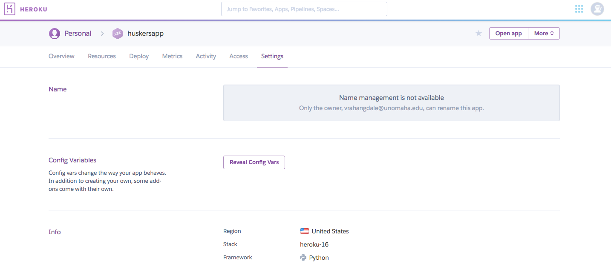
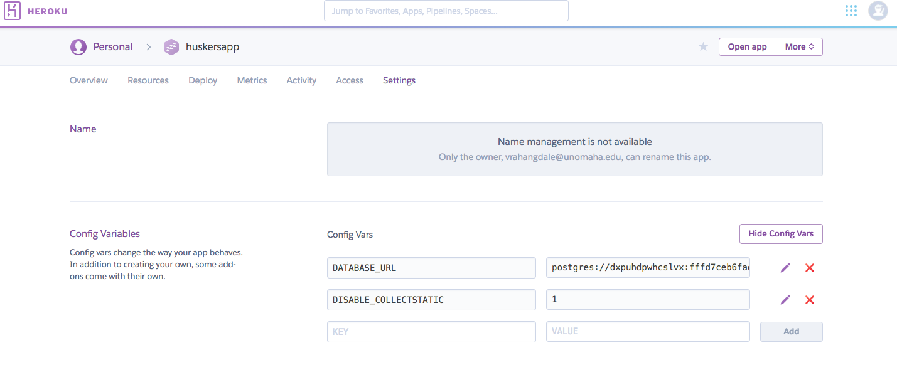
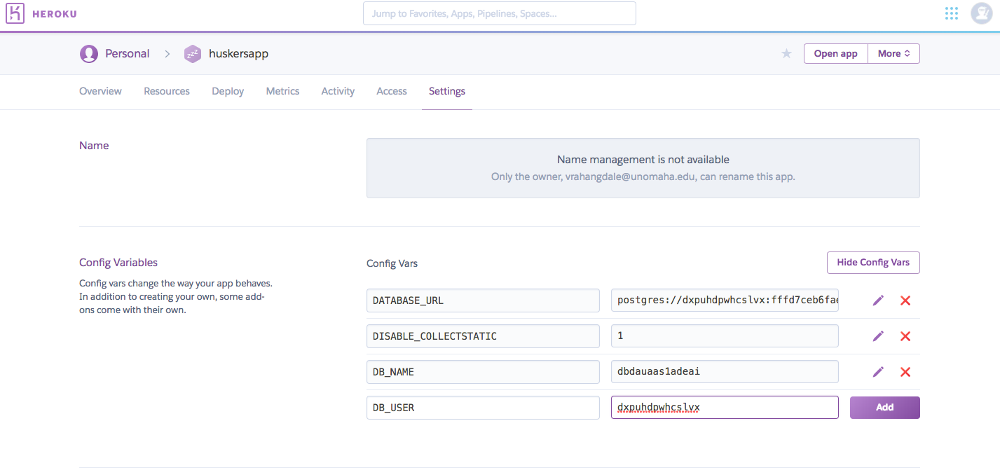

# Deploy Django Projects to Heroku

This is a guide deploy Django Projects on Heroku, securely using Python Decouple. Instead of using the ```settings.py``` file to store all the configuration information and secure keys of APIs, python-decouple provides a secure way of storing the information and deploying on Heroku. Lets get started!

## Installation

* Add the python-decouple package to your ```requirements.txt``` file in your Django Project. 

* This can be done by simply adding the line ```python-decouple``` to the end of the file

* Run the requirements.txt file using pip to install the package

```
pip install -r requirements.txt
```

## Usage

* Now we will take our ```settings.py``` file and move information from it to a local environment file

* First create a file named ```.env``` in the root of your project. 

* Add the ```.env``` file to your ```.gitignore``` file to ensure the file does not get pushed to GitHub

> Remember, the ```env``` file is only supposed to serve your local development environment, so any information added here should refer to your local development configuration such as database name, host etc.

* Add the following information from your ```settings.py``` file to the ```.env``` file

```
SECRET_KEY=<Secret key from settings.py file here>
DEBUG=True
DB_NAME=<Your database name here>
DB_USER=<Your database username here>
DB_PASSWORD=<Your database password here>
DB_HOST=<Your database hostname here>
DB_PORT=<Your database port number here>
```

* Consider the following sample ```settings.py``` file

```
import os

SECRET_KEY = '3izb^ryglj(bvrjb2_y1fZvcnbky#358_l6-nn#i8fkug4mmz!'
DEBUG = True
DATABASES = {
    'default': {
        'ENGINE': 'django.db.backends.postgresql',
        'NAME': 'Django_DB',
        'USER': 'django_user',
        'PASSWORD': 'hA8(scA@!fg3*sc&xaGh&6%-l<._&xCf',
        'HOST': '127.0.0.1',
        'PORT': 5432,
    }
}
```

* For the above case, the ```.env``` file would look like below

```
SECRET_KEY=3izb^ryglj(bvrjb2_y1fZvcnbky#358_l6-nn#i8fkug4mmz!
DEBUG=True
DB_NAME=Django_DB
DB_USER=django_user
DB_PASSWORD=hA8(scA@!fg3*sc&xaGh&6%-l<._&xCf (If you do not have password for your local DB, set this to empty '')
DB_HOST=127.0.0.1
DB_PORT=5432
```

* Now go back to your ```settings.py``` file 

* Add the python-decouple package at the top of the file

* Retrieve the settings parameter from the ```.env``` file you just created

* Considering the same example as shown above, your ```settings.py``` should now look like below

```
import os
from decouple import config

SECRET_KEY = config('SECRET_KEY')
DEBUG = config('DEBUG', cast=bool)
DATABASES = {
    'default': {
        'ENGINE': 'django.db.backends.postgresql',
        'NAME': config('DB_NAME'),
        'USER': config('DB_USER'),
        'PASSWORD': config('DB_PASSWORD'),
        'HOST': config('DB_HOST'),
        'PORT': config('DB_PORT'),
    }
}
```

* Its no longer needed to use a ```local_settings.py``` file and include it in the ```settings.py``` file. 

* Remove the below lines from the ```settings.py``` file in case it exists

```
try:
    from .local_settings import *
except ImportError:
    pass
```

* The environment variables can be added for all the API keys so that they are not exposed directly from the settings file. 

* Suppose you have settings for the email configuration, they can be translated as below

* Inside the ```.env``` file, add the below information

```
EMAIL_HOST = smtp.gmail.com
EMAIL_PORT = 587
EMAIL_HOST_USER = example@gmail.com
EMAIL_HOST_PASSWORD = hlmoijelwgikzxtz
EMAIL_USE_TLS = True
```

* And then update the email configuration in your ```settings.py``` file as below

```
EMAIL_HOST = config('EMAIL_HOST')
EMAIL_PORT = config('EMAIL_PORT')
EMAIL_HOST_USER = config('EMAIL_HOST_USER')
EMAIL_HOST_PASSWORD = config('EMAIL_HOST_PASSWORD')
EMAIL_USE_TLS = config('EMAIL_USE_TLS')
EMAIL_BACKEND = 'django.core.mail.backends.smtp.EmailBackend'
```

* Extending the same functionality, we can do this for the API keys we use in our application

* Suppose, you have API keys for implementing Social Authentication in your application

* Inside the .env file, add the API key information as below:

```
SOCIAL_AUTH_FACEBOOK_KEY = 2014701805577940
SOCIAL_AUTH_FACEBOOK_SECRET = 93fefcfaf39ced0fe2dfda1b818a0ad2

SOCIAL_AUTH_TWITTER_KEY = NHuZqTxNdEHZqlIRToTgyH4oO
SOCIAL_AUTH_TWITTER_SECRET = b8JN998u3FbuocGBZ2fTAcjo7dB2sB6wuTOYeGZRmXBDzT3imN

SOCIAL_AUTH_GITHUB_KEY = 18daec47735b8d476139
SOCIAL_AUTH_GITHUB_SECRET = 1137e348adf3522881212536532fe87e7344a99f

SOCIAL_AUTH_GOOGLE_OAUTH2_KEY = 563302953971-ji2i092b21a5l1447n5a32ku93njjeae.apps.googleusercontent.com
SOCIAL_AUTH_GOOGLE_OAUTH2_SECRET = lcMoQqatS67aJGi3-Az0hgTl
```

* And then update the social authentication API keys in your ```settings.py``` file as below

```
SOCIAL_AUTH_FACEBOOK_KEY = config('SOCIAL_AUTH_FACEBOOK_KEY')
SOCIAL_AUTH_FACEBOOK_SECRET = config('SOCIAL_AUTH_FACEBOOK_SECRET')

SOCIAL_AUTH_TWITTER_KEY = config('SOCIAL_AUTH_TWITTER_KEY')
SOCIAL_AUTH_TWITTER_SECRET = config('SOCIAL_AUTH_TWITTER_SECRET')

SOCIAL_AUTH_GITHUB_KEY = config('SOCIAL_AUTH_GITHUB_KEY')
SOCIAL_AUTH_GITHUB_SECRET = config('SOCIAL_AUTH_GITHUB_SECRET')

SOCIAL_AUTH_GOOGLE_OAUTH2_KEY = config('SOCIAL_AUTH_GOOGLE_OAUTH2_KEY')
SOCIAL_AUTH_GOOGLE_OAUTH2_SECRET = config('SOCIAL_AUTH_GOOGLE_OAUTH2_SECRET')
```

## Deploy to Heroku

* Inside Heroku's dashboard, select your app, and click on the Settings Tab


* Inside the Settings tab, click on Reveal Config Vars button


* Add the information as you have done for your ```.env``` here


Thats it and the Heroku app is all setup.

* You can find a sample ```.env``` file [here](./.env.example)

* You can download this file and rename it to ```.env``` and add the configuration parameters, or simply create a ```.env``` file and copy the contents in the format shown.

[Go to Top](#deploy-django-projects-to-heroku)
