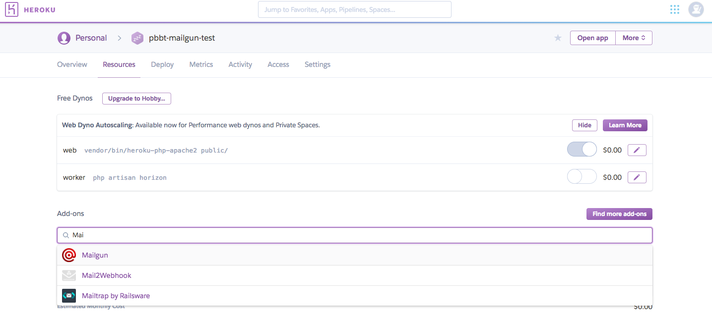

## Steps to setup Mailgun client on Heroku for Laravel Projects

* Deploy your application on Heroku and ensure it is running properly

* Go to Resources and click on Find More add-ons


* Search for Mailgun from the Heroku Home Page



* Click on the Mailgun add-on and install the extension for your application


* To use the free plan, provided by Mailgun, credit card information must be provided on your Heroku account. (There will be no charge, but card must be added)


* Once the Mailgun is added on Heroku, for your application, it automatically creates a test domain, called sandbox*****.mailgun.org


* You can click on your application's mailgun add-on to see the Domain information and other configuration details.


* Now go to your Laravel project, and open it in your preferred code editor or IDE


* To use the mailgun driver, install Guzzle using the command, from your terminal
```
composer require guzzlehttp/guzzle
```


* Open the ```config/mail.php``` file, and change the ```driver``` option to ```mailgun```


* Next open, the ```config/services.php file```. Here you will find configuration option for third party services. Laravel already has configuration options for mailgun. You need to add your domain and API key from Heroku here.


* Go to your Heroku Mailgun add-on, which we created above, and copy the domain name and API key, and add them in the ```config/services.php``` file under the mailgun options


* Once the configuration is completed, we can now send emails through our routes file or configure our routes to use controllers for sending emails.


* Once easy way to test if it works, would be to try directly from the ```routes/web.php``` file. (Example shown below)
```
Route::get('send_test_email', function(){
	Mail::raw('Sending emails with Mailgun and Laravel is easy!', function($message)
	{
		$message->subject('Mailgun and Laravel are awesome!');
		$message->from('no-reply@website_name.com', 'Website Name');
		$message->to('johndoe@gmail.com');
	});
});
```


## Documentation
[Laravel Mail](https://laravel.com/docs/5.6/mail)

[Mailgun](https://documentation.mailgun.com/en/latest/)


### Notes
In case of using the free plan with Mailgun, you should authorize recipients to receive mail

* Go to mailgun add-on on Heroku.
* Click on your domain
* Here you will see a ```Authorized Recipients``` section
* Add users email addresses in this section
* The added users will receive a confirmation email, which they have to accept in order to receive mails from your application via mailgun.
* Once this is completed, the added users will be able to receive emails from your application via mailgun.
